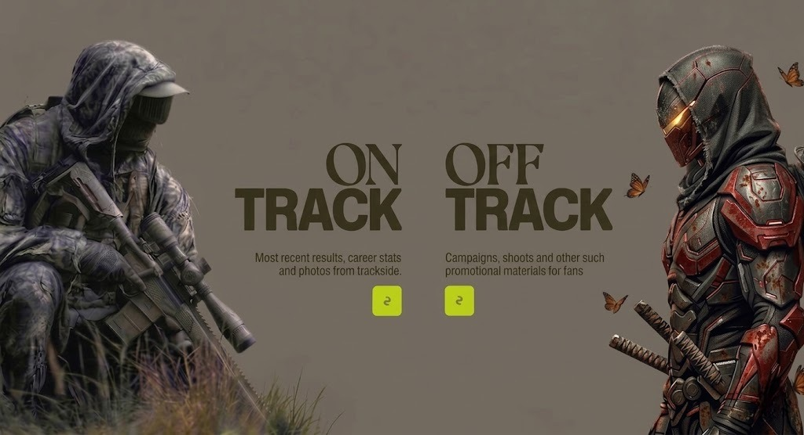

# 问题 #2: 两个按钮垂直位置未对齐

- **严重程度**: 🟡主要
- **类别**: 布局
- **问题层级**: 结构性（描述文本高度不一致导致按钮错位）
- **精度要求**: 近似即可
- **文件**: `src/components/WorksDetailSection.tsx`
- **代码位置**: 第 350 行和第 377 行（描述文本），第 353-365 行和第 380-392 行（按钮）

## 期望设计参考



设计稿中，两个黄绿色按钮在同一水平线上。

## 根因分析

两侧描述文本高度不同：
- 左侧 "Most recent results, career stats and photos from trackside." → 2 行（39.2px）
- 右侧 "Campaigns, shoots and other such promotional materials for fans" → 3 行（58.8px）

按钮使用 `mt-5`（24px）固定 margin-top，导致右按钮被更高的描述文本推低约 **19.6px**。

## 当前问题

右按钮 Y=561.7px，左按钮 Y=542.1px，相差 19.6px。设计稿中两按钮应在同一水平线。

## 修复指令

**方案 A（推荐）：给描述文本容器设置固定最小高度**

1. 打开 `src/components/WorksDetailSection.tsx`
2. 第 350 行，左侧描述 `<p>` 添加 `min-h-[3.8rem]`：
   ```
   className="mt-4 min-h-[3.8rem] max-w-[13rem] text-center text-[0.74rem] ..."
   ```
3. 第 377 行，右侧描述 `<p>` 同样添加 `min-h-[3.8rem]`：
   ```
   className="mt-4 min-h-[3.8rem] max-w-[13rem] text-center text-[0.74rem] ..."
   ```

`min-h-[3.8rem]` ≈ 60.8px，足以容纳 3 行文本（58.8px），两侧描述区域高度统一后，按钮自然对齐。

响应式断点同理：`sm:min-h-[3.4rem] md:min-h-[3rem]`（更大字号时行数可能减少，需实测调整）。

## 策略提示

如果 min-height 方案在某些断点不够精确，备选方案：
- 将每列改为 `flex flex-col`（已是），对按钮使用 `mt-auto` 让其自动推到列底部
- 但需确保列有固定高度或 `flex-1` 在描述文本上

## 验证方式

在浏览器中查看，两个黄绿色按钮应在同一水平线上。通过 DevTools 测量两个按钮的 `top` 值，差异应 < 3px。

## 不要修改

- 描述文本内容
- 按钮图标和大小
- 按钮的 `mt-5 sm:mt-6` margin（除非改用 mt-auto 方案）
- "ON TRACK" / "OFF TRACK" 标题的字体和布局
- 问题 #1 的修复（translate-x 值）

---

> 修复完成后，请将你的思路和操作步骤写入：
> `fix-logs/02_button-vertical-misalignment_log.md`
>
> 日志格式：
> 1. **理解**：你对这个问题的理解
> 2. **分析**：你检查了哪些代码，发现了什么
> 3. **方案**：你选择的修复方案及原因
> 4. **改动**：具体修改了哪些文件的哪些行
> 5. **验证**：你如何确认修复成功
> 6. **遗留**：是否有未解决的问题或担忧
> 7. **可调参数**：关键数值位置
